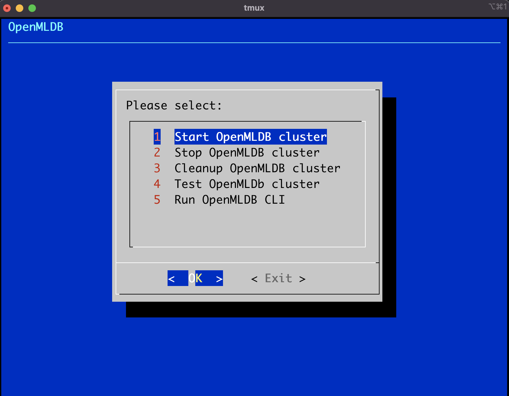

# Portable OpenMLDB

The portable OpenMLDB cluster which can be run anywhere without installation. Here are the features:

* Try and test OpenMLDB cluster **without installation**.
* Setup **full-featured OpenMLDB cluster** without network.
* **Persist the cluster and data** in U Disk to run anywhere.
* One commmand to **upgrade to the latest OpenMLDB** version.

## Download

If you want to run OpenMLDB without installation and network, just download the pre-built package.

```
wget http://topic-land.com:39137/portable_openmldb/0.7.2/portable_openmldb.tar.gz

tar xzf ./portable_openmldb.tar.gz
```

The downloaded files can be run offline in Linux and MacOS. You can put the files in hard disk or U Disk.

## Usage

| Operation | Command | Introduction |
| --------- | ------- | ------------ |
| Start Cluster | `./start.sh` | This will start ZooKeeper(1 Node) and OpenMLDB cluster(1 NameServer/2 Tables/1 APIServer/1 TaskManager). |
| Stop Cluster | `./stop.sh` | This will stop ZooKeeper and OpenMLDB cluster.  |
| Cleanup Cluster | `./cleanup.sh` | This will cleanup all the data of ZooKeeper and OpenMLDB. |
| Test Cluster | `./test.sh` | This will run simple smoke test for OpenMLDB cluster. |
| Use Cluster | `./openmldb_cli.sh` | This will start OpenMLDB CLI to access the database. |
| Upgrade Cluster | `./upgrade.sh` | This will upgrade OpenMLDB to latest version. You should backup the data before upgrading which may cleanup all the data. |
| GUI Console | `./console.sh` | This will start the GUI console witch can use cursor to do the above operations. |



Notice that `dialog` is required for `./console.sh`.

```
# Install in Ubuntu
apt install -y dialog

# Install in MacOS
brew install dialog
```

## Build from Scratch

If you want to build the package file with custom binaries, please run with the following commands.

```
./download_packages.sh

./update_udisk_packages.sh

./build_portable_openmldb.sh
```

## Run with Docker

Start the pre-built docker container.

```
docker run -it -p 2181:2181 -p 7527:7527 -p 10921:10921 -p 10922:10922 -p 9080:9080 -p 9902:9902 tobegit3hub/portable-openmldb
```

Build the docker image by yourself.

```
cd ./docker/

./build_docker.sh
```

## Run in Kubernetes

Start OpenMLDB service in Kubernetes cluster.

```
cd ./kubernets/

kubectl create -f ./portable-openmldb-deployment.yaml

kubectl create -f ./portable-openmldb-service.yaml
```
